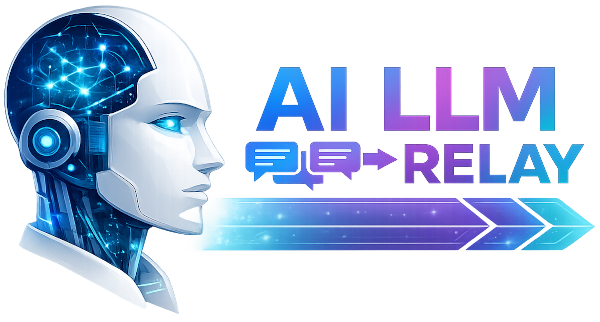
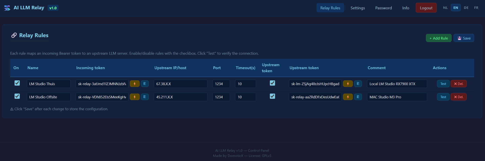

# AI LLM Relay

A flexible PHP-based relay for OpenAI-compatible LLM servers (LM Studio, Ollama, vLLM, Anthropic, etc.).

Easy deployment on a shared hosting or VPS/DS, no SQL database needed!

**What can it be used for?**

- You are running LLM software locally on your own network (for example with LM Studio).
- Port forwarding is configured on your router.
- You want to hide your private IP address.
- You have multiple LLM machines active on your network; this relay allows users to select the target machine.
- You can route the IP and port based on the provided token.

## Features

- **Token routing**: Route incoming Bearer tokens to different upstream LLM servers
- **Admin panel**: XHTML/CSS/JavaScript GUI for managing relay rules
- **Secure login**: Password hash (bcrypt) + anti-brute-force math challenge
- **Streaming**: Direct streaming passthrough to the client
- **Connection tests**: Test upstream connections from the admin panel
- **Export**: Download the full configuration as JSON
- **Multilingual UI**: Interface available in Dutch, English, German and French

## Screenshot



## File Structure

```
index.php         — Admin panel (login + GUI)
relay.php         — Relay logic (handles all LLM API requests)
relay.css         — Stylesheet for the admin panel
translation.json  — Translations (NL / EN / DE / FR)
config.json       — Relay configuration (auto-created)
auth.json         — Password hash (auto-created)
.htaccess         — URL rewriting and security
robots.txt        — Prevents search engine indexing
favicon.ico       — Icon (32×32) for browser and navbar
```

## Installation

### Requirements

- PHP 7.4 or higher
- PHP extensions: `curl`, `json`, `session`
- Apache with `mod_rewrite` enabled

### Steps

1. Upload all files to your web server (e.g. `/public_html/llm/`)
2. Verify that `mod_rewrite` is active
3. Open `https://yourdomain.com/llm/` in your browser
4. Set your admin password on the first-run setup screen
5. Add relay rules via the "Relay Rules" tab
6. Save and test the connections

### Plesk / Nginx

If your server is behind Nginx (e.g. Plesk), add the following to the **Extra Nginx directives**:

```nginx
proxy_set_header Authorization $http_authorization;
proxy_pass_header Authorization;
```

This is required so that the `Authorization` header (with Bearer token) is forwarded to PHP.

## Usage

### Creating a relay rule

1. Go to the **Relay Rules** tab
2. Click **+ Add Rule**
3. Fill in:
   - **Name**: Descriptive name (e.g. "LM Studio Home")
   - **Incoming token**: The token clients will send (e.g. `my-relay-token`)
   - **Upstream IP/host**: IP or hostname of the LLM server
   - **Port**: Port of the LLM server (default: 1234 for LM Studio)
   - **Timeout**: Connection timeout in seconds
   - **Upstream token**: Check to forward a token to the upstream
   - **Upstream token value**: The token for the upstream (if required)
   - **Comment**: Optional note
4. Check the **On** checkbox to activate the rule
5. Click **Save**

### Calling the API

Use the relay as a standard OpenAI-compatible API:

```bash
# Chat completions
curl -sS \
  -H "Authorization: Bearer YOUR_INCOMING_TOKEN" \
  -H "Content-Type: application/json" \
  -d '{"model":"gpt-3.5-turbo","messages":[{"role":"user","content":"Hello"}]}' \
  https://yourdomain.com/v1/chat/completions

# List models
curl -sS \
  -H "Authorization: Bearer YOUR_INCOMING_TOKEN" \
  https://yourdomain.com/v1/models
```

### Supported endpoints

| Path | Method | Description |
|------|--------|-------------|
| `/v1/models` | GET | List of available models |
| `/v1/chat/completions` | POST | Chat Completions (streaming supported) |
| `/v1/completions` | POST | Text Completions (legacy) |
| `/v1/embeddings` | POST | Text embeddings |
| `/api/v1/models` | GET | LM Studio API alias |
| `/api/v1/chat/completions` | POST | LM Studio API alias |
| `/anthropic/*` | POST | Anthropic API paths |

### Configuring LM Studio

1. Open LM Studio → "Local Server"
2. Click "Start Server" (default port 1234)
3. Set in relay rule: IP = your home IP, port = 1234
4. Make sure your router forwards port 1234 to your PC

### Open WebUI / SillyTavern

Configure the API URL as:
```
https://yourdomain.com/v1
```
With your incoming relay token as the API key.

## Security

- Password is stored as a **bcrypt hash** (cost 12)
- Anti-brute-force **math challenge** on the login screen
- `config.json` and `auth.json` are blocked via `.htaccess`
- Tokens are compared using `hash_equals()` (timing-safe)
- Session cookies are `HttpOnly` and `SameSite=Strict`

## Troubleshooting

### 401 Unauthorized

- Check that the incoming token exactly matches the configuration
- Check that the relay rule is active (checkbox checked)

### 502 Bad Gateway

- Check the upstream IP address and port
- Use the **connection test** in the admin panel
- Check that the LLM server is reachable

### Authorization header missing

Add to `.htaccess` (already present):
```apache
SetEnvIf Authorization "(.*)" HTTP_AUTHORIZATION=$1
```

Or for Nginx/Plesk, see the installation section above.

## License

GPLv3 — Made by [DomoticX](https://domoticx.net)

---

## Roadmap / TODO

Planned features for future versions:

- [ ] **1. Model-aware routing** — Route based on the requested model name in addition to the Bearer token.
  - Map incoming model names to specific upstreams (e.g. `gpt-4o` → OpenAI, `mistral-small` → LM Studio, `qwen-coder` → offsite server)
  - Wildcard model filters: `mistral*`, `qwen*`, `gpt*`
  - Benefits: cost optimisation, GPU load distribution, per-model failover

- [ ] **2. Load balancing (round-robin / weighted)** — Distribute requests across multiple upstreams per rule.
  - Configure weight per upstream (e.g. LM Studio Home weight 2, LM Studio Offsite weight 1 → 2/3 local, 1/3 offsite)
  - Useful for multi-GPU setups, multiple LM Studio nodes, and clusters

- [ ] **3. Auto-failover + health scoring** — Automated upstream health monitoring.
  - Measure latency and track timeout failures per upstream
  - Compute a health score and auto-disable unhealthy upstreams
  - Relay automatically selects the best available upstream

- [ ] **4. Usage & token accounting** — Per-upstream and per-token usage tracking.
  - Track prompt tokens, completion tokens, request count, average latency, and errors per upstream
  - Per incoming token: consumption, cost estimate, and quota enforcement
  - Makes the relay billing-ready for SaaS / multi-tenant deployments

- [ ] **5. IP / origin restrictions** — Restrict which IPs or domains may use a given token.
  - Token A → only allow from IP `1.2.3.4`
  - Token B → only allow from domain `chatxpert.nl`
  - Prevents token misuse if credentials leak

- [ ] **6. Request / response logging (debug mode)** — Optional toggleable logging.
  - Separate toggles for: log prompts, log responses, log headers
  - Useful for debugging tool-calling issues, model compatibility, and OpenAI/Claude API differences

- [ ] **7. Tool-aware routing** — Route based on the content of the request.
  - If `tools[]` is present → route to GPT-4o; otherwise → Mistral
  - Content-type routing: vision requests → Qwen-VL, code → DeepSeek-Coder, chat → Mistral

- [ ] **8. Response caching** — Cache responses by `(model, prompt hash)` key.
  - Identical prompts return instantly from cache
  - Reuse embeddings and system prompts
  - Major performance gain for RAG pipelines

- [ ] **9. Token limiter / context guard** — Prevent oversized requests from overwhelming specific upstreams.
  - Set per-upstream max token limits (e.g. 8k for RX7900, 32k for offsite)
  - Auto-route to a large-context node when `context > 12k`
